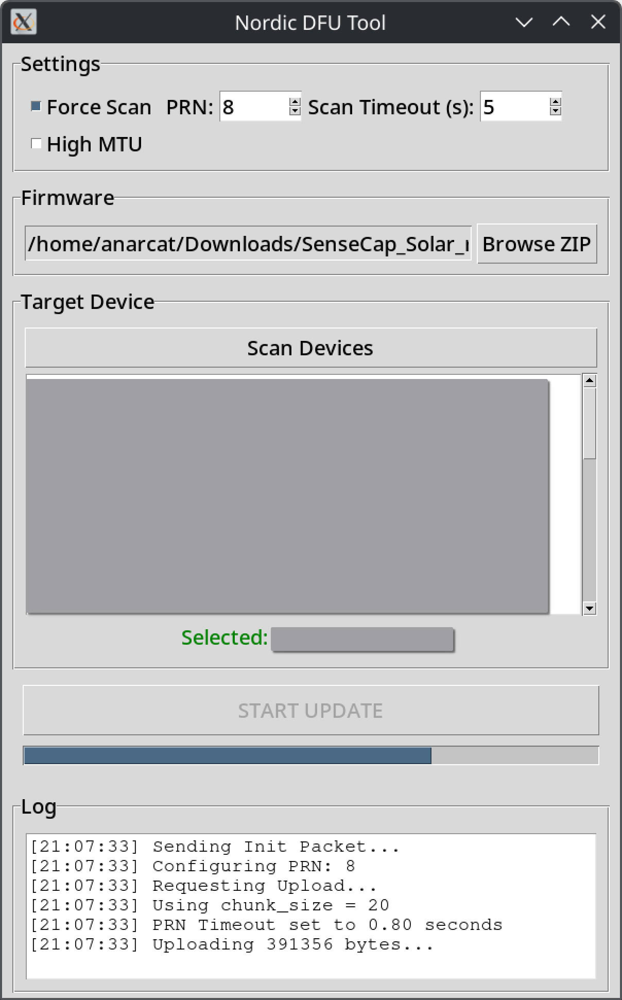

# Upgrades

Typically, devices can be safely upgraded by flashing them with the
new version, which is done by connecting to the device over a USB
cable. If not, you need to perform an over the air upgrade.

## Normal upgrades

For a device you can connect over USB, follow the [Flash the firmware
on companions](companion.md#flash-the-firmware-on-the-device) instructions.

To be on the safer side, it's always a good time to [perform a backup](companion.md#backing-up-before-flashing).

Just make sure to avoid doing an "erase"!

This page specifically concerns upgrades on repeaters, which can be
trickier because they are often harder to reach physically. If you
*can* connect a USB cable to the repeater, just do so and [flash the firmware](companion.md#flash-the-firmware-on-the-device)

## OTA upgrades

> [!EXAMPLE] Advanced users only
> 
> Over-the-air (OTA) upgrades are risky and should be used only if
> remote access is inconvenient, or if you have a secondary device to
> run a first test run on.
> 
> Beginners shouldn't need to follow those instructions.
> 
> You should also *not* do your initial flash over the air, it's not
> worth it!

> [!WARNING]
> Only use this for upgrades and *only* if you performed the above
> [Boot loader OTA fix](repeater.md#boot-loader-ota-fix)!

Once your device is [correctly flashed for OTA (over the air) upgrades](repeater.md#boot-loader-ota-fix),
you should be able to perform upgrades remotely. This is typically
done from an Android phone, but can also be done from a Linux
computer, or even [from a drone](https://blog.meshcore.io/2026/06/22/drone-ota).

This guide will cover Android and Linux.

### Android

[The official OTA guide](https://blog.meshcore.io/2026/04/02/nrf-ota-update) and the [Ottawa Mesh guide](https://ottawamesh.ca/meshcore/update-repeater-ota/) use a
proprietary Android app to flash an image remotely. A few tips:

 - if you have a custom Android firmware, you might not have access to
   the App store and the [nRF Device Firmware Update app](https://play.google.com/store/apps/details?id=no.nordicsemi.android.dfu&hl=en_US). You can
   add [this GitHub repository](https://github.com/nordicsemi/Android-DFU-Library) to Obtainium instead, which works fine.

 - you *must* change the settings in the app before flashing the
   upgrade, if you get a timeout, it's because the settings are wrong.

 - flashing over Bluetooth is slow, we're seeing 3KB/s transfer speeds

Here is a full procedure, but see the official or Ottawa mesh guide if
it fails (and let us know):

 1. install the [nRF Device Firmware Update app](https://play.google.com/store/apps/details?id=no.nordicsemi.android.dfu&hl=en_US) ([source code](https://github.com/nordicsemi/Android-DFU-Library)
    which can be installed through Obtainium)

 2. configure the right settings in the app which is called `DFU`:
 
     - Packet receipts notification - **ON**
     - Number of packets - **8**
     - Request high MTU (Android only) - **OFF**
     - Disable resume - **ON**
     - Prepare object delay - **0 ms**
     - Force scanning - **ON**

    Leave the other settings untouched.

 3. download the right firmware for your device in the [MeshCore web
    flasher interface](https://flasher.meshcore.io), make sure you pick the `.zip` file!

 4. connect to the device command-line, which should be accessible
    over the LoRa management interface

 5. type the following magic command:

        start ota

    This will show the Bluetooth MAC address of your device, which can
    be used to identify it below.

 6. back in the app, start the update, by tapping `Select` and picking
    the `.zip` file you downloaded earlier

 7. select the device which should show up as something like
    `SENSECAP_SOLAR_OTA` and also show the MAC address above

 8. press start

    This will go through various steps. If you have messed up the
    settings, it will like timeout at the `DFU initialized`
    step. Otherwise it should show a progress bar and transfer rate
    after that.

 9. you're done!

### Linux (graphical)

If you don't own an Android phone or want to avoid proprietary
software, or generally are not a fan of installing apps and upgrading
software with your thumbs, you can use a Linux computer (and, in fact,
a small device like a Raspberry Pi) to (remotely!) upgrade a device
"over the air" (OTA).

This guide is based on the code written by the Slovakian crew who gave
us the amazing [drone upgrades](https://blog.meshcore.io/2026/06/22/drone-ota) but we'll stay modest and only use
their [desktop application](https://github.com/recrof/nrf_dfu_py) for this guide.

Start at step 2 if you already have the application installed.

 1. install the application
 
     this can be done by cloning the [repository](https://github.com/recrof/nrf_dfu_py) or installing the
     binary. We'll assume you're familiar with git and will clone the
     repository (otherwise follow the [upstream instructions](https://github.com/recrof/nrf_dfu_py#installation)):
     
        git clone https://github.com/recrof/nrf_dfu_py

 2. install dependencies
 
     You might already have it installed through a package, on Debian
     for example:
     
        sudo apt install python3-bleak python3-tk

 2. launch the application
 
        cd nrf_dfu_py
        python dfu_gui.py

 3. download the right firmware for your device in the [MeshCore web
    flasher interface](https://flasher.meshcore.io), make sure you pick the `.zip` file!

 4. connect to the device command-line, which should be accessible
    over the LoRa management interface

 5. type the following magic command:

        start ota

    This will show the Bluetooth MAC address of your device, which can
    be used to identify it below.

 6. back in the application, start the update, by hitting `Browse ZIP`
    and picking the `.zip` file you downloaded earlier

 7. select the device which should show up as something like
    `SENSECAP_SOLAR_OTA` and also show the MAC address above

 8. review the settings
 
     Typically, the defaults Just Work, but you might want to review
     the [upstream instructions](https://github.com/recrof/nrf_dfu_py#usage).

 8. click `START UPDATE`

The update takes about a minute and will look like this:

### Linux (command line)

You can also do this from the command line. The command is simple and
magic:

    python dfu_cli.py --scan firmware.zip MyDevice

You can also target multiple devices, customize retries, etc. See the
[upstream guide for more details](https://github.com/recrof/nrf_dfu_py#2-command-line-interface-cli). Here's an example of upgrading a SenseCAP:

    git clone https://github.com/recrof/nrf_dfu_py || true
    wcurl https://flasher.meshcore.io/releases/download/repeater-v1.17.1/SenseCap_Solar_repeater-v1.17.1-d929643.zip?repo=github
    python ./nrf_dfu_py/dfu_cli.py --scan SenseCap_Solar_repeater-v1.17.1-d929643.zip SENSECAP_SOLAR_OTA

The URL comes from the [`flasher.meshcore.io`](https://flasher.meshcore.io) site, and should be
updated to follow the release you want to flash.

> [!WARNING]
> This is untested. The GUI version was done and works and the
> command line likely works similarly well.
