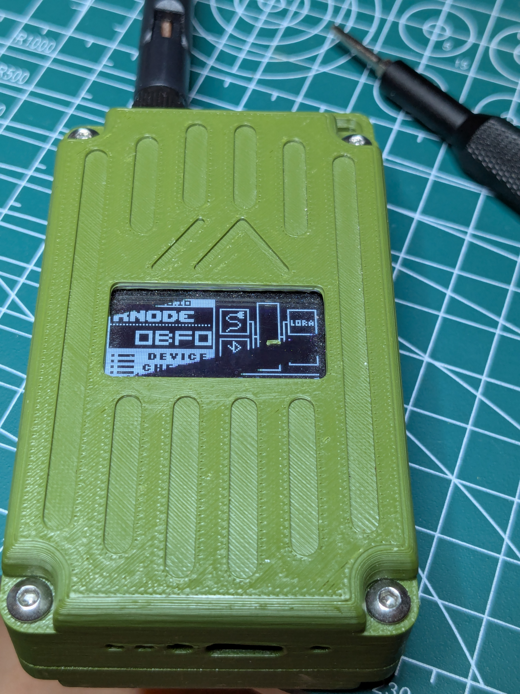
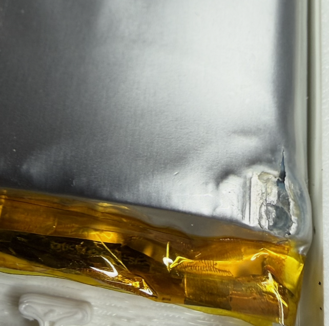
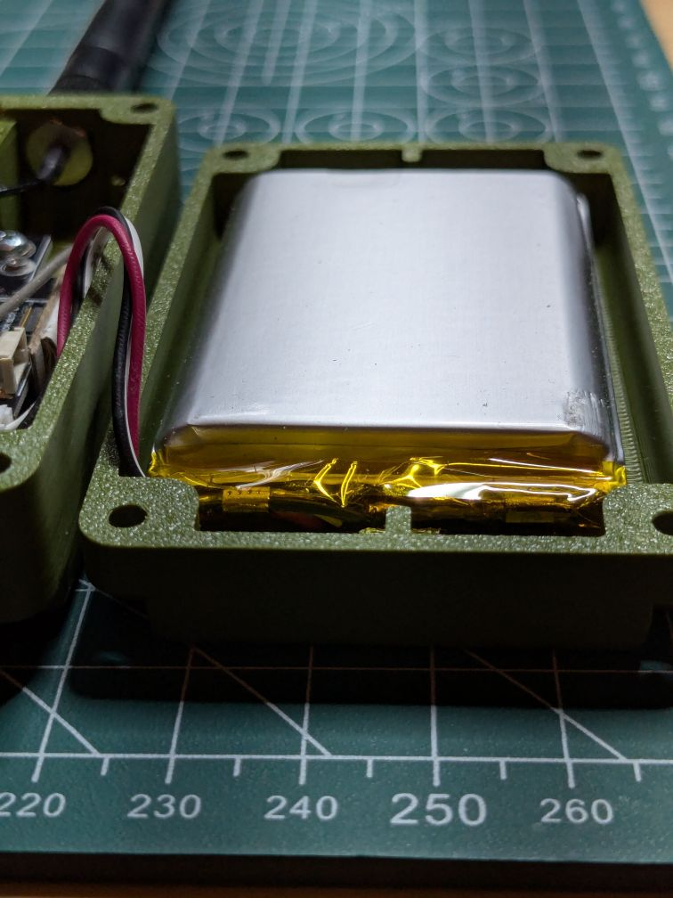
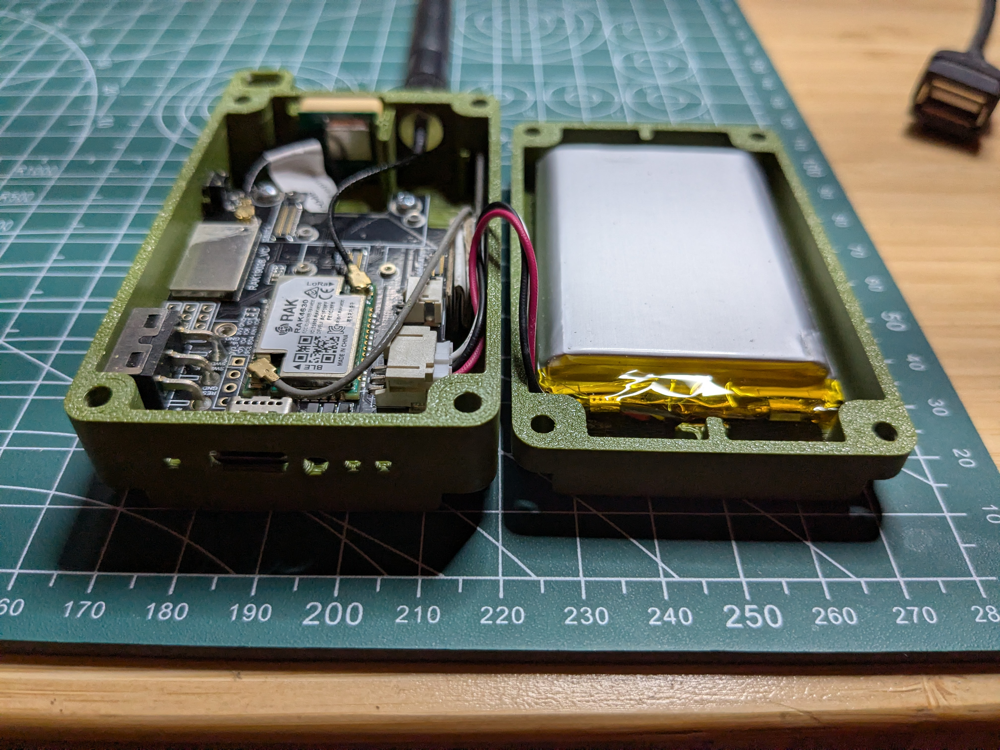
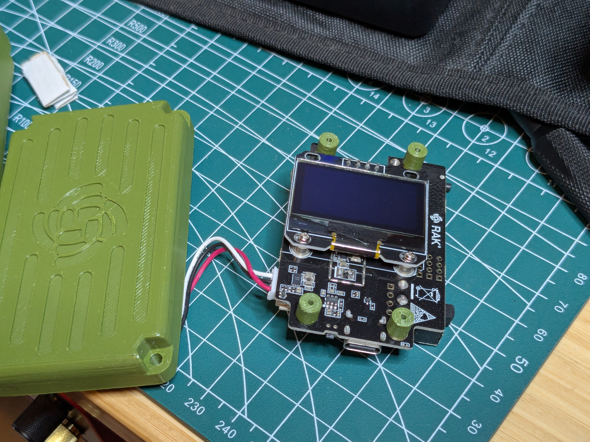
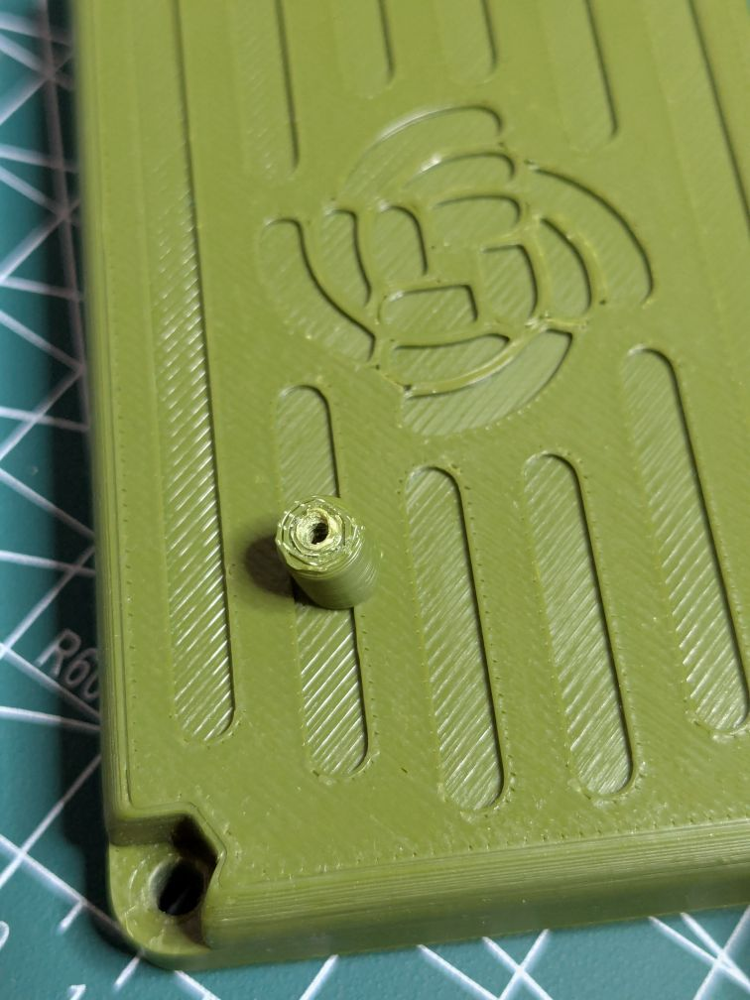

---
date:
  created: 2026-08-26
title: Fire hazard on the WisMesh Pocket
categories:
  - announcements
---

<figure markdown="span">
{ width=250 }
  <figcaption>A WisMesh Pocket V2</figcaption>
</figure>

<figure class="inline end" markdown="span">
    { align=right width=200}
  <figcaption>Perforated battery pouch with a bulge</figcaption>
</figure>

This is a public service announcement concerning the [WisMesh Pocket
V2](https://store.rakwireless.com/products/wismesh-pocket) as sold by RAK Wireless. We have on-hands experience with two
devices that exhibit premature wear and tear of the battery pouch due
to what seems to be a design flaw. 

!!! warning

    We have reasons to believe WisMesh Pocket V2 devices present a
    fire hazard and need to be immediately inspected for internal damage.

<!-- more -->

One device was acquired by anarcat directly from RAK wireless and
another by Sean from Rokland.

Rokland acknowledged the issue and shipped back a replacement. We are
waiting for a statement from RAK wireless.

<figure class="inline end" markdown="span">
{align=right}
  <figcaption>Slightly scratched battery pouch without bulge</figcaption>
</figure>

## Action to take

To ensure the safety of your device, please take the following steps:

 1. remove the four screws holding the case together, with the screen
    facing down
 2. delicately open the *back* of the case outwards, to the **right**
    side
 3. look at the **bottom right** of the battery for physical damage
 4. if the battery is bulging or scratched, consider replacing the
    battery entirely, or, as a temporary measure, disconnect the
    battery from the board

In any case, we encourage you to contact your supplier for support if
you find any anomaly.

## Issue description

<figure class="inline end" markdown="span">

  <figcaption>An opened WisMesh Pocket with a small scratch (on the right) mirroring
  the location of the power switch (on the left)</figcaption>
</figure>

It seems like the case design physically connects the edge of the
power switch to the lithium-ion battery pouch. The sharp angles on the
switch scratches the pouch which can puncture. In anarcat's case, it
only showed some small scratches, but for Sean, the battery pouch was
actually perforated and inflated.

We feel this is a serious flaw in the WisMesh Pocket V2 design. The
case should be a little bit thicker to leave room for the battery and
the power switch.

In anarcat's case, this flaw was also compounded with a problem with
the pins holding the board to the back of the case, which torn off
from the back, leaving the main board loose in the case.

<figure class="inline end" markdown="span">

  <figcaption>A board attached to four pegs broken off from the front cover</figcaption>
</figure>

## What we did

We first contacted Rokland to see if they could do something about it,
and they sent a replacement device.

Then we contacted RAK Wireless with the following question while
writing this (on 2026-08-26):

> Subject: fire hazard in WisMesh pocket v2
> 
> I have concerns with the design of the WisMesh pocket v2. i believe the power switch scratches against the battery pouch which can lead to being punctured and, ultimately, fire or explosion.
> 
> a colleague of mine already had a device returned with Rokland, but i believe the problem is not a simple case of replacing a device, but a fundamental design flaw.
> 
> i am about to publish an article about this for the local Montreal mesh community.
> 
> are you aware of this design flaw? are there plans to do a recall of those devices?
> 
> thanks for your prompt response.

We'll update this announcement as we hear from RAK. So far they have
confirmed reception of our message and requested further photos which
were provided.

<figure class="inline end" markdown="span">

  <figcaption>A broken peg before glue</figcaption>
</figure>

## Workaround and next steps

It seems possible to glue back the pegs with "crazy glue" or some
other similar compound. 

But clearly the prints are not solid enough to withstand casual use:
this device was anarcat's daily driver for less than a year before
first switching to a Lilygo T-Echo and then a Wio Tracker L1 Pro.

For now we strongly discourage everyone from getting a WisMesh Pocket
until this situation is clarified.

Other RAK Wireless products are, as far as we know, not plagued with
similar design flaws. We warmly recommend the RAK Solar Mini repeater,
the WisMesh Tag, and the 4631 kits for DIY builds!
