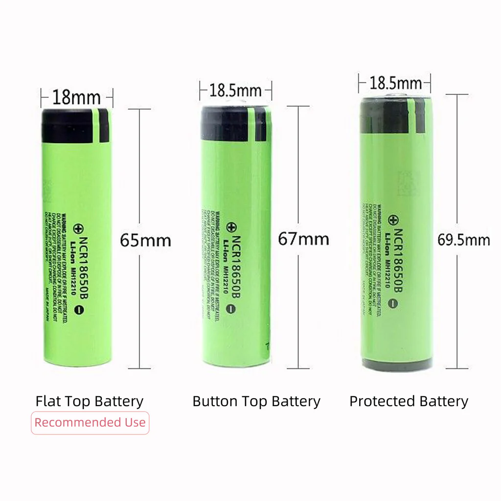

# Batteries

Battery setups depends on the particular device.

Battery cells need to be handled with care, see [this discussion about
those batteries](https://wiki.why2025.org/Badge/Fire_hazard), for example. So far it seems most folks use
normal "unprotected" cells in various devices, without any
problems. As long as you handle the batteries with care, you should be
fine.

## 18650

The [Heltec v4 prebuilt kit](https://heltec.org/project/wifi-lora-32-v4-expansion-housing/) and the [SenseCAP Solar Node P1](https://www.seeedstudio.com/SenseCAP-Solar-Node-P1-for-Meshtastic-LoRa-p-6425.html),
like many other devices, uses [18650 battery cells](https://en.wikipedia.org/wiki/18650_battery). 

### Sizes

18650 batteries look like bigger AA batteries, but they are not "C" or
"D" batteries either: they are longer and thinner than a "D". 18650
batteries are named after their size: 18mm wide, and 65mm long.[^1]
    
[^1]: Wikipedia claims the 0 is the digit after 65mm ("65.0mm").
    
They are not all exactly that same size: some 18650 batteries have a
"button" (like the positive side of AA batteries) and some are "flat"
(like negative size, but on both ends). Some have a "protection"
circuit inside that makes them even longer.
    
This makes some 18650 batteries fit in one case and not another. A
"buttoned" battery might not fit in a case because it's too long and a
"flat" battery might fit but not connect at all because it is not long
enough!

In particular, we found out that:

- the [Heltec v4 prebuilt kit](https://heltec.org/project/wifi-lora-32-v4-expansion-housing/) *requires* flat top batteries and
  even then, they are *tight* and hard to remove
- the [SenseCAP Solar Node P1](https://www.seeedstudio.com/SenseCAP-Solar-Node-P1-for-Meshtastic-LoRa-p-6425.html) *requires* button top batteries,
  otherwise you will not be able to use or charge the batteries reliably

???+ tip
   
    Here's an example of 3 batteries from the Lilygo website:
       
    

### Where to buy

You can buy those batteries in ["vape shops"](https://www.openstreetmap.org/search?query=vape+shop&zoom=12&minlon=-74.07085418701173&minlat=45.36975515764875&maxlon=-73.19263458251955&maxlat=45.662286836234586#map=12/45.4999/-73.5775) and various electronics
shops also hold stock:

- Addison: has 5-10$CAD flat batteries near the LEDs desk at the
  St-Michel store, not on the website
- Abra: [Samsung 25R 18650 2500mAh 20A](https://abra-electronics.com/batteries-holders/batteries-polymer-lithium-ion/bat-18650-s.html) (flat) for 10$CAD
- Mastervox: [3.7V 3000mAh](https://www.mastervox.com/fr_CA/pieces/batterie/rechargeable/bat18650b_37-batterie-li-ion-18650-bouton-37v-3000mah) (button) for 10$CAD, based in Joliette
  and Longueuil
- Veshra: [`EVE 35V INR18650` 3500mAh 10.2A](https://www.veshra.io/products/cmmi0b7ct0000ddfj49kcys1l) (flat) for 6$CAD
- AliExpress: [`Kuugro ku-3500` 18650 Battery 3500mAh 3.7V 12A](https://www.aliexpress.com/item/1005009897181947.html)
  (button) for 2$CAD, 90$CAD for 20, price varies according to your
  visit, current sweet spot is actually 8 batteries for 46$
  (5.75$CAD/battery)
- MP&W: [Button Top EVE 35V Battery Cell, Single Cell](https://mpandw.ca/products/button-top-eve-35v-house-made) (button) for
  8.50$CAD, spot-welded buttons from a Ottawa maker, [EVE 35V 18650
  3500mAh](https://mpandw.ca/products/eve-35v-18650-battery-cells-set-of-6-with-holders) (flat) 6 for 36$
- <https://www.18650batterystore.com/en-ca>: 12$ for protected
  button-top, 2-6$ for flat-top, Manu had a good experience there

## Pouch cells

Those cell packs are more used in DIY kits or lab setups:

- [Makerfocus](https://www.makerfocus.com/products/makerfocus-3-7v-3000mah-lithium-rechargeable-battery-1s-3c-lipo-battery-pack-of-4) has [3.7V 3000mAh Lithium Rechargeable Battery 1S 3C
  LiPo Battery (Pack of 4)](https://www.makerfocus.com/products/makerfocus-3-7v-3000mah-lithium-rechargeable-battery-1s-3c-lipo-battery-pack-of-4) for 25$USD

## Below freezing

Contrary to popular belief, it seems like lithium-ion batteries [work
fine below freezing](https://yycmesh.com/blog/cold-weather-charging) although we still need to confirm the results
from the folks in Calgary ourselves. The Calgary folks are using plain
unprotected batteries below freezing without issues.

For really remote relays that are difficult to service, they started
using [LTO batteries](https://en.wikipedia.org/wiki/Lithium-titanate_battery) which are better suited to handle deep freeze
-- we're talking -40℃ on mountaintop -- conditions.

## Charger

You might also want to have a charger if you deal with a lot of 18650
batteries.

!!! warning

    Do *not* try to charge 18650 batteries in a normal "AA" battery
    charger! They won't fit and it won't work.

You don't need a charger for a single device: devices normally come
with their own charge controller and can charge over whatever power
source they normally use (USB-C, Solar, etc).

It is just nice to slot them in a device already charged, and they are
not necessarily sold charged.

- Abra: [4-battery charger](https://abra-electronics.com/batteries-holders/battery-chargers-automotive/bat-charger-14-li-ion-battery-charger-4-slots-usb-bh-042100-04u.html), 15$: works well, LEDs turn green when
  full, needs a 5V 1-2A USB-A power supply (not included), 1A output
- Addison: ["universal" 4-battery charger](https://addison-electronique.com/en/universal-battery-charger-for-li-ion-aa-aaa-aaaa-and-c-batteries-usb.html), 60$: untested, seems
  overpriced, includes cigarette lighter adapter and AC power plug, 1A
  output
