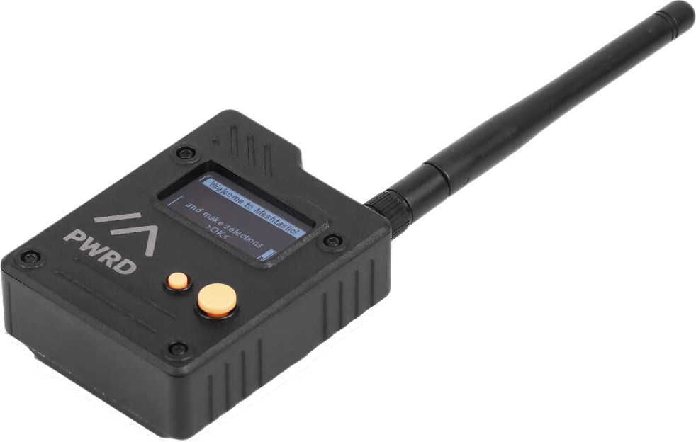
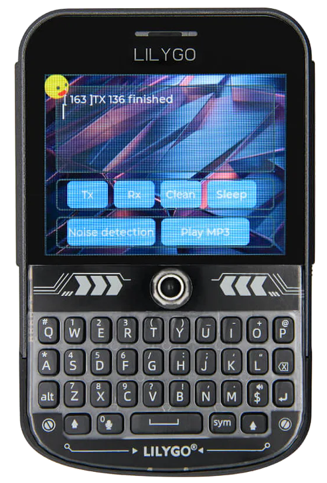
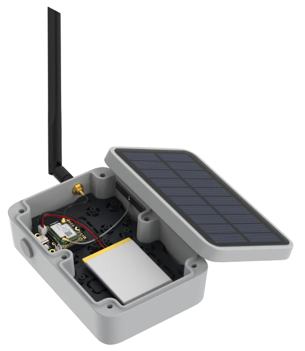
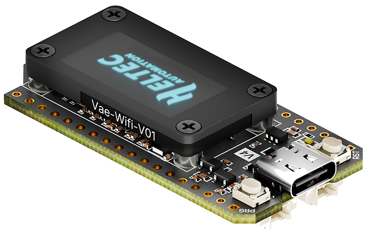
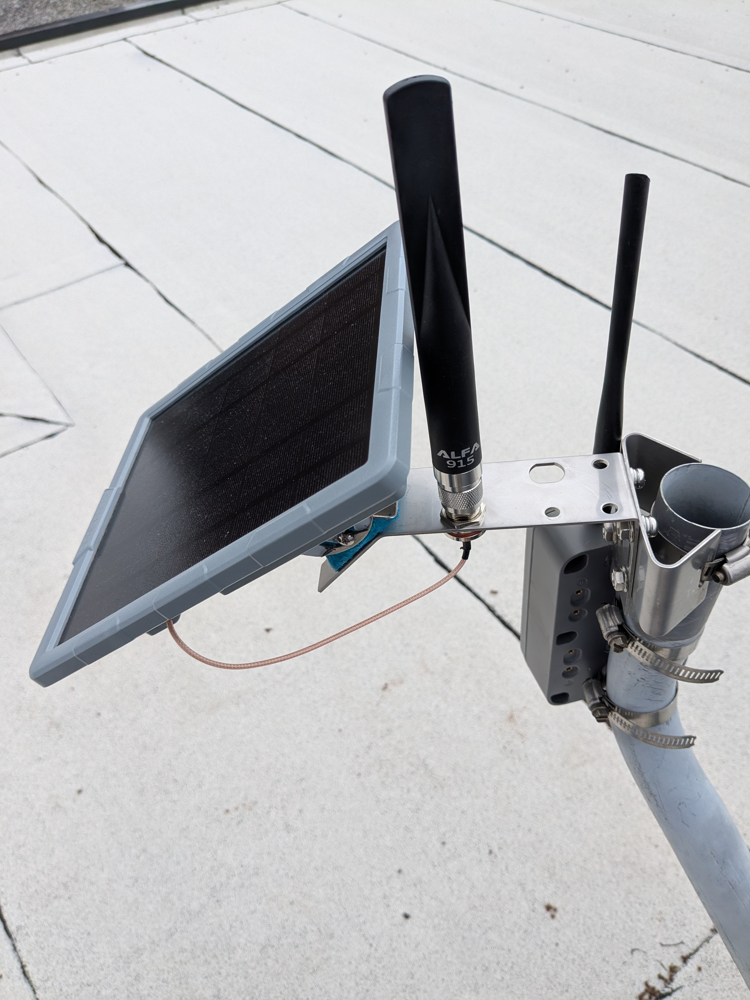
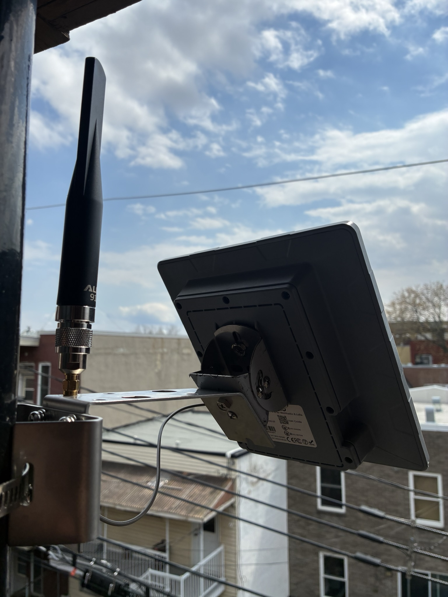

# Hardware options

This page documents a certain number of LoRa and Meshtastic hardware
devices we have tested or somehow evaluated. It is of course not
exhaustive, and it is opinionated in the sense that it tries to guide
you towards specific purchases to simplify your life. 

[Let us know](../../contact.md) if you want to buy a lot so we can organize.

## Recommended hardware

This is the easiest, "just tell me what to buy" guide. There are more
options below, but we only recommend devices that we have tested
ourselves.

-   :material-cellphone-cog: **Companion**: [SeeedStudio Wio Tracker L1
    Pro](https://www.seeedstudio.com/Wio-Tracker-L1-Pro-p-6454.html)
    
    ---
    
    

    The Tracker is small, sturdy, has a good battery life, a power
    switch and is cheap enough to get started.
    
    It needs a separate app, for example on your phone, but can be
    used to read messages with the buttons, in a pinch. No water
    resistance.

    [62$ at Robotshop](https://ca.robotshop.com/products/seeedstudio-wio-tracker-l1-pro-w-oled-3d-printed-casing?qd=db7541740aaa06e3d86db98e2079eb94)

    :material-chart-line: **Alternatives**: 

    - [RAK Wireless WisMesh Tag](https://store.rakwireless.com/products/wismesh-tag-meshtastic-gps-lora-tracker-ip66): credit-card sized, waterproof
      (IP66), two buttons, no display, magnetic USB pogo charging,
      40$USD

    - [Lilygo T-Echo](https://lilygo.cc/products/t-echo-lilygo): e-ink display, only two buttons, no power button,
      45$USD, [T-Echo Plus](https://lilygo.cc/products/t-echo-plus) has a better battery for 66$USD

-   :material-cellphone-basic: **Standalone**: [T-Deck plus](https://lilygo.cc/products/t-deck-plus-1)

    ---

    
    
    Has keyboard and screen (yes, like a [BlackBerry](https://en.wikipedia.org/wiki/BlackBerry)), useful if
    you don't want to use your phone.
    
    70$USD.

    :material-chart-line: **Alternatives**:
    
    - [Heltec v4 prebuilt kit](https://heltec.org/project/wifi-lora-32-v4-expansion-housing/): touch-screen only, 50-60$USD
    - [Lilygo T-Lora Pager](https://lilygo.cc/products/t-lora-pager): smaller, quirkier, 90$USD

-   :octicons-sun-16: **Repeater**: [WisMesh Solar Repeater Mini](https://store.rakwireless.com/products/wishmesh-meshtastic-solar-repeater-mini)

    ---
    
    
     
    For window, rooftop or in a tree installations, the mini is
    flexible and can be upgraded to a more powerful setup with a [1W
    booster kit](https://store.rakwireless.com/products/meshtastic-1w-lora-booster-kit-rak3401?variant=45678368882886).
    
    100$USD.
    
    :material-chart-line: **Alternatives**:
    
    - Cheaper, less flexible alternative [SenseCAP Solar Node P1](https://www.seeedstudio.com/SenseCAP-Solar-Node-P1-for-Meshtastic-LoRa-p-6425.html),
      70$USD, [130$ with GPS and battery at Robot Shop](https://ca.robotshop.com/products/sensecap-solar-node-p1-pro-for-meshtastic-w-gps-battery?qd=c71a67155c4fec187b2b07ee9a7af9f3).
    - [1W solar repeater build](https://meshcore.ca/hardware/repeater-solar-1w-diy-build/) from Ottawa, 300$+, requires some
      soldering and tools

-   ⎇ **Kit**: [HELTEC v4](https://heltec.org/project/wifi-lora-32-v4/)

    ---
    
    

    This is a bare bones kit for hackers, running bots, or if you're
    really broke.
    
    The V4 is as simple (it's essentially a Arduino) and as cheap as
    it goes. The v4 does not come with a case, but one can be
    [3d-printed](#cases), or get the [v3](https://heltec.org/project/wifi-lora-32-v3/) which ships with a
    case. Make sure to pick 902-928MHz.
    
    You need to provide power over USB, any USB-C charger will do,
    needs a separate app, for example on your phone

    20-30$USD.
    
    :material-chart-line: **Alternatives**:
    
    - SeeedStudio [XIAO ESP32S3 & `Wio-SX1262` Kit](https://www.seeedstudio.com/XIAO-ESP32S3-for-Meshtastic-LoRa-with-3D-Printed-Enclosure-p-6314.html) is 11$USD, but
      without a display or case.
    - RAK [WisBlock RAK4631](https://store.rakwireless.com/products/wisblock-meshtastic-starter-kit?variant=43884035113158) is 25-62$USD, is more powerful and
      uses less power
  

!!! tip
    
    If you're just starting, just get the cheapest device you can get
    your hand on quickly, it's 50$. Plug it into your phone, a USB
    charger or a battery, and get talking!

## How we classify devices

We have those categories:

!!! success

    Those devices were successfully tested and used on a daily
    basis. A select few of those end up being recommended above. 
    We only "recommend" one device per category to simplify user's
    choices but "success" devices should be also considered 
    recommended.

!!! example "In testing"

    We have our hands on those devices and are testing them. So far,
    they work, but need more testing before they can be promoted to a
    full "success".

!!! question "Untested"

    Those devices are interesting, but we haven't lay our hands on
    them yet.

!!! warning

    We tested those devices, and there are serious caveats against
    using them. Do not order one unless you know what you read an
    understand the note on the device.

!!! failure "Not working"

    We tested those devices, and we recommend against using them entirely.

Note that the devices are rated for compliance with Meshcore for the
moment, but should generally also work with Meshtastic. 

Reticulum support is spottier, and not explicitly covered here. Each
software project has their own list of compatible hardware which we do
not try to cover here.

## Companions

Those are day-to-day use device, can you can easily carry in a pocket
or a pouch. Those generally have a battery. They need a phone or
computer to operate.

!!! success
 
    - [SeeedStudio Wio Tracker L1
    Pro](https://www.seeedstudio.com/Wio-Tracker-L1-Pro-p-6454.html):
    1.3" OLED, 3D-Printed Casing, 2000mAh battery, GPS, nRF5284 /
    SX1262, 4-way joystick, menu button, reset button, power switch, 3 LEDs
    43$USD, [62$ at Robotshop](https://ca.robotshop.com/products/seeedstudio-wio-tracker-l1-pro-w-oled-3d-printed-casing?qd=db7541740aaa06e3d86db98e2079eb94)

    - [WisMesh Pocket V2](https://store.rakwireless.com/products/wismesh-pocket): GNSS, 1.3" OLED, acceleration sensor, power
      button, 3200mAh battery, USB-C powered, 100$
    - [T-Echo](https://lilygo.cc/products/t-echo-lilygo): 200x200 e-ink
      display, NRF52840, GPS, BT 5.0, no wifi, two buttons, no power
      button, NFC, 850mAh battery, temperature/pressure sensor, 55$USD
    - cheap [Aliexpress Heltec v4 kit, 43CAD](https://www.aliexpress.com/item/1005010640444191.html)
    - Seeedstudio [XIAO ESP32S3 & Wio-SX1262 Kit](https://www.seeedstudio.com/XIAO-ESP32S3-for-Meshtastic-LoRa-with-3D-Printed-Enclosure-p-6314.html): tiny, - 40℃ ~
      100℃, WiFi 2.4GHz, BLE 5.0 / Mesh, reset/boot button, 22x23x57mm,
      37g, exposed GPIO ports, cheap (20$), does not ship with
      Meshtastic firmware, needs full erase before reflash or gets
      into a boot loop
    - [RAK Wireless WisMesh Tag](https://store.rakwireless.com/products/wismesh-tag-meshtastic-gps-lora-tracker-ip66): 
      1000 mAh battery, IP66 rating, two buttons, status LED,
      magnetic USB pogo charging, nRF52840/SX1262, GPS, 92 x 59 x 7.5
      mm, 40$USD
    - [SeeedStudio SenseCAP Card Tracker T1000-E](https://www.seeedstudio.com/SenseCAP-Card-Tracker-T1000-E-for-Meshtastic-p-5913.html) (40$USD)
      IP65, 700mAh battery, nRF52840/LR1110, GPS, 85 * 55 * 6.5 mm,
      32g, -20℃ to +60℃ operation, buzzer, magnetic pogo pins USB charging, 40$USD, anarcat managed get [this one in a boot loop](https://anarc.at/services/meshtastic/#bricked) 
      but eventually recovered. Nice and portable, waterproof. See
      [this guide for how to use that single button](https://wiki.seeedstudio.com/sensecap_t1000_e_meshcore/#button),
      in particular use triple-click to turn off the buzzer.

!!! example "In testing"

    - [Elecrow ThinkNode M1](https://www.elecrow.com/thinknode-m1-meshtastic-lora-signal-transceiver-powered-by-nrf52840-with-154-screen-support-gps.html):
      nRF52840, 1200mAh battery, 1.54" e-ink display, GPS, BLE, RP-SMA,
      -10~50°C, 54$USD, [89$CAD at Muzi](https://muzi.works/products/elecrow-thinknode-m1), similar to the Lilygo T-Echo, but has a better battery

!!! question "Untested"

    - [Muzi](https://muzi.works/) has builds on top of the Heltec, e.g. [this H2T](https://muzi.works/products/h2t-complete-device-heltec-t114-with-gps-running-meshtastic)
      (137CAD) made with a Heltec T114, [this R1 Neo](https://muzi.works/products/r1-neo-complete-meshtastic-device) (123CAD) is
      similar to the WisMesh Pocket, but smaller, better sealed, but more
      expensive
    - [SenseCAP MeshTracker X1](https://www.seeedstudio.com/sensecap-meshtracker-x1-meshtastic-gps-tracker-p-6935.html): 
      Next generation of the T1000-E. LR2021, IP66, USB-C connector,
      1100mAh, claims 5 days battery, dual GPS, BT, 1 RGB LED, 2 buttons, -20 to 60℃
      operation, 90*57*8 mm, 45g, 43$USD.
    - [Meshtiny](https://meshtiny.com/product/meshtiny/): tiny
      companion, nRF52840, SX1262, OLED, Buzzer, user, reset button,
      power switch, 3-way encoder button, two LEDs, 250mAh Battery, 60$USD
    - [GAT562 Meshtastic Tracker](https://shop.mtoolstec.com/product/gat562-mesh-tracker):
      nRF52840/SX1262, 60g, 2500mAh battery, GPS, 1.3-inch TFT screen, [some open designs](https://github.com/quhyhao/GAT562)

<!-- !!! failure "Not working" -->

## Standalone

Those are day-to-day use device, can you can easily carry in a pocket
or a pouch. They have a battery and do *not* need a phone or computer
to operate.

!!! success

    - [Heltec v4 prebuilt kit, 50-60USD](https://heltec.org/project/wifi-lora-32-v4-expansion-housing/): touch screen, 18650 flat-top
      battery (tight, hard to remove), belt clip bulges the back
      cover.
    - [Lilygo T-Deck Plus](https://lilygo.cc/products/t-deck-plus-1) (80$): blackberry-like, standalone device
      with battery, keyboard, trackball, LCD display, 2000mAh battery,
      BLE, WiFi, GPS, MicroSD card reader, microphone/speake. Note that
      an order in March 2026 took 24 days to deliver.
    - [Lilygo T-Lora Pager](https://lilygo.cc/products/t-lora-pager):
      smaller, quirkier, 90$USD. Keyboard and wheel are unreliable,
      and it has no touch scren. It's really cute though.

!!! question "Untested"

    - [T-Deck Pro](https://lilygo.cc/products/t-deck-pro): 3.1" e-ink touch screen, 4G module, WiFi 2.4GHz,
      BLE 5, GPS, TF Card, mic, speaker, keypad, see also the [T5 e-paper
      s3 pro](https://lilygo.cc/products/t5-e-paper-s3-pro).
    - Elecrow M9, not yet released, similar to the D-Teck, LCD
      display, no touch screen, real time clock, GPS, SD card, to be confirmed.
    - [Attaky Mesh desk](https://shop.attaky.com/products/attaky_mesh_deck?variant=52819861537084): 
      modular ESP32 kit with battery, SX1262 radio, GPS receiver, 48-keys
      QWERTY keyboard, custom 1000 mAh battery, 68 × 97 × 29.8 mm,
      157g ([data sheet](https://docs.attaky.com/docs/datasheets/builds/mesh-deck)),
      240$USD, runs wadamesh
    - [Tanmatsu cyberdeck](https://shop.nicolaielectronics.nl/shop/tanmatsu-9/tanmatsu-cyberdeck-3?attribute_values=1). 
      ESP32-P4,  E22-900M22S LoRa radio, microSD card socket,
      3D-printed case, QWERTY keyboard, 2500mAh Li-Po battery, audio
      jack and speaker, expansion port, opensource, 100EUR, runs
      wadamesh
    - [M5 Cardputer Adv](https://shop.m5stack.com/products/cardputer-mesh-kit-for-meshtastic-esp32-s3?variant=48684913164545).
      ESP32 handheld, 1.14" LCD, 56-key keyboard, 1750mAh lithium,
      microphone, 1W speaker and audio jack, infrared, microSD, SX1262
      expansion port, not supported by stock Meshcore firmware, but
      many alternative firmware, for example: [`MultiMote/meshcore-cardputer-adv`](https://github.com/MultiMote/meshcore-cardputer-adv), [`sosprz/meshcore-cardputer-adv`](https://github.com/sosprz/meshcore-cardputer-adv), [`Stachugit/MeshCore-Cardputer-ADV`](https://github.com/Stachugit/MeshCore-Cardputer-ADV)

Note that those devices depend on the proprietary Ripple firmware, but
you can now try the [Wadamesh](https://wadamesh.com/) firmware as well, which is open
source, and is *much* more intuitive and powerful. Its only downside
is that it seems to be developed with the help of an LLM (Claude).

### Cyberdecks

A special kind of device that's worth its own section is the
[cyberdeck](https://en.wikipedia.org/wiki/Cyberdeck). That's a custom-built device that often runs *more*
than the basic firmware, sometimes a full (Linux) operating system
which allows for more functionality than the basic standalone device.

Typically, Cyberdecks are hand-crafted, but here we cheat a little and
list pre-built devices or kits.

The main thing that separates this from the above standalone devices is
that they are more generic Linux computers with more capabilities than
embedded devices above.

!!! success

    - Clockwork PI [uConsole](https://www.clockworkpi.com/uconsole).
    wrapper around a Raspberry PI CM4, with modular expansion ports: 720p 5.0-inch IPS screen,
    74-keys QWERTY keyboard with gaming buttons, 18650 battery
    module, cellular modem, and a [third party SDR, LoRa, GPS, USB,
    RTC, ethernet module](https://hackergadgets.com/products/uconsole-aio-v2?variant=47045380735150).
    [Video review](https://youtu.be/oN9zw3lzSVc) says the built-in
    WiFi antenna is not great but can be modified with a 3D printer,
    and that the trackball is not great. 6-7h runtime, half with a SDR.

!!! question "Untested"

    - [Mecha Comet](https://mecha.so/comet#overview). pre-order as of July 2026, supports LoRa
      through a M.2 connector, to be clarified.
    - M5 (who made the Cardputer Adv above) also made a [Cardputer zero](https://shop.m5stack.com/pages/m5-cardputerzero) 
      which is a real Raspberry Pi underneath, while still being
      compatible with the [Cap LoRa 1262](https://shop.m5stack.com/products/cap-lora-1262-for-cardputer-adv-sx1262-atgm336h)

There there is a long list of small computers like the [MNT Reform](https://mntre.com/reform.html)
[pocket](https://shop.mntre.com/products/mnt-pocket-reform) that are relatively normal computers, without necessarily
any specific LoRa hardware. But you can still hook up a LoRa modem
over USB, for example.

In any case, you'll need software other than the stock (or
third-party) firmware to talk on the mesh with those devices. The
uconsole has its own [`meshcore-uconsole`](https://github.com/cwill747/meshcore-uconsole) firmware, for others
there are various wrappers around the [Python library](https://blog.meshcore.io/2026/05/12/pymc-intro) (previously
called `pyMC`, now called [openHop](https://github.com/openhop-dev)) like [`tui-meshcore`](https://github.com/guax/tui-meshcore).

[This blog post](https://blog.meshcore.io/2026/05/12/pymc-intro) explains the `pyMC` project further and lists a
couple of devices you can hookup to your computer directly:

- Muzi works [NULLHOP MeshToad v3](https://muzi.works/products/nullhop-meshtoad-v3) (65CAD)
- Elecrow [Mesh Tadpole SX1262 USB stick](https://www.elecrow.com/meshtadpole-sx1262-usb-stick.html) (19$USD)
- MeshSmith [PiMesh-1W HAT](https://meshsmith.net/products/pimesh-1w) (60$USD, for a Raspberry Pi)
- Zindello [Ultrapeater](https://zindello.com.au/ultrapeater/) (~66$USD, also for a Raspberry Pi)

## Repeaters

Those are bulkier devices that are mounted on a mast or are used as a
back-haul, possibly with a special [antenna](#antennas). The devices may or
many not have batteries.

!!! success

    - [WisMesh Solar Repeater
      Mini](https://store.rakwireless.com/products/wishmesh-meshtastic-solar-repeater-mini):
      solar, battery, mast or wall-mountable, cheaper than their full
      repeater, 100$USD. Works through the night in summer time, needs testing
      through winter.

    - [SenseCAP Solar Node P1](https://www.seeedstudio.com/SenseCAP-Solar-Node-P1-for-Meshtastic-LoRa-p-6425.html): 70$USD, outdoors solar-powered relay
      with 4x18650 **button-top**[^1] batteries, nRF4840, BT 5.0, 3 buttons, 5
      LEDs, USB-C for debug, RP-SMA, [recommended by
      `nyme.sh`](https://nyme.sh/faq/). Note that the base kit doesn't
      ship with the actual batteries, or the GNSS device, for that you
      need the [Pro
      kit](https://www.seeedstudio.com/SenseCAP-Solar-Node-P1-Pro-for-Meshtastic-LoRa-p-6412.html)
      which is 20$ more. Needs to be tested through night and
      winter. Also sold at
      [RobotShop
      for
      100CAD](https://ca.robotshop.com/products/sensecap-solar-node-p1-meshtastic-w-o-gps-battery),
      [130$ with GPS and
      battery](https://ca.robotshop.com/products/sensecap-solar-node-p1-pro-for-meshtastic-w-gps-battery?qd=c71a67155c4fec187b2b07ee9a7af9f3).

[^1]: It's really important to get button-top batteries for the
      SenseCAP Solar node P1! Normal flat-top batteries won't connect
      correctly. Seriously consider buying it *with* batteries, as
      button-top batteries are often more expensive, which makes the
      RobotShop kit particularly attractive.

!!! question "Untested"

    - [WisMesh Solar Repeater](https://store.rakwireless.com/products/wismesh-meshtastic-solar-repeater): solar, battery, mast-mountable, 
      300$, SenseCAP Solar Node P1 much cheaper.

    - [WisMesh Ethernet Gateway](https://store.rakwireless.com/products/wismesh-ethernet-gateway): no battery, no solar ([might be
      convertible](https://forum.rakwireless.com/t/ethernet-gateway-with-batteries-solar/14601),
      but ethernet and PoE, note that [management over Ethernet is not
      possible in Meshtastic](https://github.com/meshtastic/firmware/issues/2908)
      and possibly other firmware, so configuration still has to go
      through Bluetooth, serial or WiFi.

    - [SenseCAP M2 indoor
      gateway](https://mappingnetwork.ca/products/sensecap-m2-indoor-gateway-lorawan-us915):
      cheaper alternative to teh WisMesh?

    - [AliExpress 5W Heltec
    kit](https://www.aliexpress.com/item/1005010224488993.html),
    [25W](https://www.aliexpress.com/item/1005006633080419.html), be
    careful as sometimes they sell a Heltec v4.2 instead of a v4.3,
    and that has problems, better to buy the Heltec separately

### Mounts

Base stations will typically be mounted on rooftops or poles.

The [Ottawa Mesh docs](https://ottawamesh.ca/hardware/repeater-mounting-options/) have great documentation and examples for
this.

## Development boards

Those are bare-bones circuit boards that *work* standalone but cannot
really be used in production as they lack a proper case.

The devices here generally do not have a battery.

!!! success

    - [HELTEC v4](https://heltec.org/project/wifi-lora-32-v4/)
      ([v3](https://heltec.org/project/wifi-lora-32-v3/)) is the
      cheapest option, v3 is 20$ (30$CAD) with the case, v4 doesn't
      ship with a case (but no battery, and battery doesn't fit in the
      case). one advantage Heltec has over the below RAK kits is that
      you can connect to them over wifi, the downside is
      they use more power because they are ESP32 based instead of
      NRF5280, might be cheaper [at AliExpress](https://www.aliexpress.com/item/1005011870647672.html)
    - the [RAK19003 base kit](https://store.rakwireless.com/products/wisblock-meshtastic-starter-kit?variant=43884035113158) (28$) is more expensive, but less
      power-hungry than the Heltec
    - [XIAO ESP32S3 & Wio-SX1262 Kit](https://www.seeedstudio.com/Wio-SX1262-with-XIAO-ESP32S3-p-5982.html):
      barebones board, tiny, cheap,
      WiFi 2.4GHz, BLE 5.0 / Mesh, reset/boot button (hidden under the
      daughterboard, press both to enter JTAG so you can flash, requires
      opening the case and removing the daughterboard), - 40℃ ~ 100℃, 22x23x57mm, 37g,
      exposed GPIO ports, no battery, 20$. Probably the cheapest and
      smallest kit all around.

!!! example "In testing"

    - [XIAO nRF52840 & Wio-SX1262 Kit](https://www.seeedstudio.com/XIAO-nRF52840-Wio-SX1262-Kit-for-Meshtastic-p-6400.html): even tinier, nRF52840,
      Semtech SX1262, NFC, BT, -40°C ~ 65°C, 22 x 21 x 17.8mm. Probably
      the smallest kit you can get. Reset button hard to reach.

!!! question "Untested"

    - [T-Beam Supreme](https://lilygo.cc/products/t-beam-supreme?variant=43067944173749): 1.3" OLED display, 18650 battery socket,
      magnetometer, 2.4GHz WiFi, BLE 5, GNSS, no case, ESP32, 52$, the [T-Beam
      SoftRF](https://lilygo.cc/products/t-beam-softrf?variant=43170158477493) is similar but without a display and cheaper, 30$USD
    - [Heltec Vision Master E290](https://heltec.org/project/vision-master-e290/): eink dev
      board, ESP32S3 SX1262, 20$USD 180 days display, WiFi, BT

### Cases

If you use a development board, you might want a case around it: most
of them (except the Heltec v3) come without a case.

The [Ottawa folks recommend](https://ottawamesh.ca/hardware/recommended-companions/) the [AlleyCat models](https://www.printables.com/@AlleyCat/models), although the
license on the page is a bit unclear, as it claims CC BY-SA but then
follows that with a paragraph limiting commercial use.

### DIY build on top of the RAK kit

The RAK19003 base kit comes *without* a case, but one [can be
printed](https://www.printables.com/model/286664-rak19003-micro-case-for-meshtastic). It's tricky because there are many (83!) design files in
there.

On top of 3D-printing the case, you need to also buy:

 - 4 × M3x20mm socket head cap screws ([this kit](https://abra-electronics.com/hardware/metric-hardware-kits/nuts/sc-h-m-ss-kit-m2-m3-m4-stainless-steel-hex-socket-cap-head-screws-washers-nuts-assortment-kit-1080pcs.html) covers this and
   the nuts)
 - 4 × M3 nuts
 - 2 × M2.5 screws (*not* part of the above kit, [length unclear](https://www.printables.com/model/286664-rak19003-micro-case-for-meshtastic/comments/2516182),
   [here are M2.5x6mm](https://abra-electronics.com/hardware/metric-hardware-round-phillips-head-screws/1968p-machine-screw-m2.5-6mm-length-phillips-25-pack.html) or [this kit](https://abra-electronics.com/hardware/metric-hardware-kits/screws-bolts/repair-kit-for-eyeglasses-watches-screws-and-nuts-caps-m1m2m2.5-stainless.html))
 - 1 × battery ([Amazon](https://www.amazon.com/gp/product/B091FKGW8H), possibly the same as [Abra](https://abra-electronics.com/batteries-holders/batteries-polymer-lithium-ion/1578-ada-lithium-ion-polymer-battery-37v-500mah-1578-ada.html),
   optional?)
 - there's also an optional [battery cutoff switch](https://www.amazon.com/gp/product/B086L2GPGX), couldn't find
   an [equivalent on Abra](https://abra-electronics.com/electromechanical/switches/pushbutton-switches/)

## Power

Moved to its own page, see [Power](power.md).

## Batteries

Moved to its own page, see [Batteries](batteries.md).

## Antennas

!!! tip

    For a more in-depth discussion about antenna testing, theory and
    practice, see the [Antennas](antennas.md) section.

We have experience with this:

- [Alfa `AOA-915-5ACM`](https://www.alfa.com.tw/products/aoa-915-5acm?variant=36473963020360), sold as a 5dBi antenna, but falls short of
  in [this technical review](https://antennatestlab.com/helium-network-antenna-reviews/alpha-network-ada-915-5acm-helium-antenna-5dbi). In practice, it's still a great
  antenna, a "great bang for the buck" according to the Ottawa folks,
  and that the antenna is closer to 3dBi. Watch out for cheap
  knock-offs, [Muzi Works sells a real one for 25CAD](https://muzi.works/products/alfa-outdoor-antenna), [My Needle
  Store (30$CAD)](https://myneedlestore.com/product/alfa-network-aoa-915-5acm-915-mhz-dipole-antenna-for-helium-iot-applications/) is local, untested

- [`SYMITANT58`](https://www.amazon.ca/Fiberglass-Antenna-Hotspot-Directional-Sensecap/dp/B09F31P1PL) (25$CAD Amazon)

- a similar (and currently cheaper) model is this [RF Explorer 800mm](https://www.seeedstudio.com/RF-Explorer-LoRa-Fiberglass-Antenna-Kit-902-930MHz-5-8dBi-800mm-p-5275.html)
  (10$USD from from SeeedStudio)

!!! warning

    The [antenna reports project](https://github.com/meshtastic/antenna-reports) warns against using a
    [SeeedStudio 600mm](https://www.seeedstudio.com/Lora-Fiberglass-Antenna-860-930MHz-5dBi-600mm-p-4927.html)
    antenna, particularly for non-US frequencies. While it is a different
    antenna, it's unclear if the above RF Explorer has the same flaw, further
    testing necessary.

- Ottawa used the [8dB SeeedStudio 1300mm at 30$USD](https://www.seeedstudio.com/RF-Explorer-LoRa-Fiberglass-Antenna-Kit-902-928MHz-8dBi-1300mm-p-5278.html) ([Mouser](https://www.mouser.ca/ProductDetail/Seeed-Studio/318020693?qs=By6Nw2ByBD0kjpJjgHd0aQ%3D%3D),
  [130$ Digikey](https://www.digikey.ca/en/products/detail/seeed-technology-co-ltd/318020693/15976337?s=N4IgTCBcDaIMwEYAcAGMKBsBOOIC6AvkA), [85$ on sale at MN](https://mappingnetwork.ca/products/rakwireless-8dbi-fiberglass-antenna))

- [Mapping Network][] has a couple of interesting antennas, some of us
  have experimented with the McGill Microwave antennas, specifically
  the [3dBi](https://mappingnetwork.ca/products/mcgill-3dbi-tuned-antenna-us915) and [6dBi](https://mappingnetwork.ca/products/mcgill-microwave-6dbi-tuned-antenna-us915) antennas

Note that, to connect those to (say) a Heltec, you will need
adapters:

    N (Antenna) --(cable)--> RP-SMA --(adaptor)--> SMA --(pigtail)--> IPEX U.FL (Heltec v4)

[Nooelec has a kit](https://www.nooelec.com/store/sdr/sdr-adapters-and-cables/sma-adapter-connectivity-kit.html).

See also [this connector guide](https://pole1.co.uk/blog/5/) for recognizing those N, RP-SMA,
SMA and IPEX connectors. And yes, in the above setup, we essentially
touch on *all* the connectors from the guide.

Other lists include:

- [Official Meshtastic guide](https://meshtastic.org/docs/hardware/antennas/), which also refers to a [series of
  antenna reports](https://github.com/meshtastic/antenna-reports)
- [`nyme.sh` recommendations](https://nyme.sh/faq/#what-antenna)
- [Ottawa Mesh recommendations](https://ottawamesh.ca/hardware/recommended-antenna/)

[Mapping Network]: https://mappingnetwork.ca/

### Alfa upgrade on the SenseCAP P1

The SenseCAP Solar Node P1 can be upgraded with an Alfa antenna
easily, but needs some sort of adapter because the stock connectors
are SMA-based.

=== "Pigtail"

    {align=right width=300}

    For this, you need a 30cm N to RP-SMA pigtail connector.

    Make sure you get a "bulkhead mount“ that has a little flat piece
    chamfered off the side, which helps prevent it from rotating in the
    hole when you tighten it down. Otherwise it won't fit in the
    socket. 

    This [20 cm pigtail from Muzi Works](https://muzi.works/products/rp-sma-to-type-n-cable-20-cm) works, but is a little short:
    you can only install it on the hole nearest to the router instead of
    the further one, as shown on the image here.

=== "Connector"

    {align=right width=300}
    
    This is a SMA to N converter that fits
    above the stock pigtail sold at [Addison](https://addison-electronique.com/).
    
    It also raises the antenna a little higher which is good because
    it clears the solar panel better. But it introduces some loss
    compared to a pigtail.
    
    !!! warning

        We have had problems with this connector, where packets
        would only be sent out and not received correctly.

## Resellers

The above lists generally link to the upstream supplier or official
resellers.

There are, however, other resellers that might be more interesting to
you for various reasons:

- [Robotshop](https://ca.robotshop.com/collections/lora): good source for the [SenseCAP P1](https://ca.robotshop.com/products/sensecap-solar-node-p1-pro-for-meshtastic-w-gps-battery), delivers fast,
  reliable, good prices. They also sell robots, SeeedStudio, Elecrow,
  but no RAK.
- [Space Hedgehog](https://space-hedgehog.com/): also more expensive; stocks Antenna, Heltec,
  based in Ottawa, related to the [Ottawa mesh](https://ottawamesh.ca/) (currently on
  hiatus for the summer)
- [Motion Power & Witt Supply Co.](https://mpandw.ca/) has [batteries](batteries.md), based in Ottawa
- [Mapping Network][]: has a [good antenna collection](https://mappingnetwork.ca/collections/antennas) and other
  devices, particularly [LMR400 cabling](https://mappingnetwork.ca/products/lmr-400-ultraflex-coaxial-cable-n-female-rp-sma-male)

!!! warning

    We've had trouble with these:

    - [Veshra](https://www.veshra.io/): more expensive, but local, possibly south shore (to be
      confirmed); stocks antennas, batteries, Heltec, currently no
      SeeedStudio, RAK, or ESP32 devices. Recent orders have failed,
      some unanswered. Not recommended anymore.

## Hacks

- [Lamp hack](https://hackaday.io/project/194509-harbor-breeze-meshtastic-hack)

## Other documentation

- [Connector types overview](https://pole1.co.uk/blog/5/)
- [Another connector guide](https://www.arcantenna.com/blogs/news/how-to-identify-coaxial-connectors)
- [Haruki's Meshtastic experiments](https://harukitoreda.github.io/Meshtastic-Experiments/) - excellent hardware review:
  compares battery life, power usage, antenna tests, comparison
  tables
