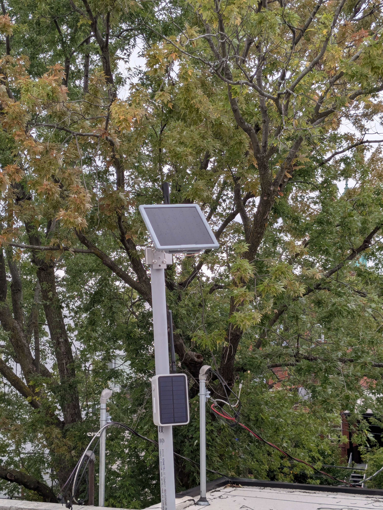

# anarcat's nodes

## YUL-Little-Italy

One of the first repeaters on the mesh! Originally a key repeater, but
now less important. Where the [weekly net](../../guides/net.md) is ran from.

### Next steps

- [ ] find a way to have both repeaters installed without interference

### 2026-09-21: flood configuration

Applied [flood configuration](../../news/posts/2026-09-20-limit-flood-and-loops.md) including `txdelay`, specifically:

```
set loop.detect moderate
set advert.interval 240
set flood.advert.interval 47
set flood.max 16
set txdelay 1
set direct.txdelay 0.5
```

### 2026-09-14: Reticulum relay moved

Reticulum relay removed from the mast to the backyard, reception improved.

### 2026-09-04: Reticulum relay modification

Relays inverted and spaced out.



### 2026-08-30: J-pole and Reticulum relay deployment

Reticulum relay (RAK Solar Mini) deployed on the same mast, causing
interference issues.

A PVC mast was added to the J-pole as well.

### 2026-05-03

Antenna upgraded to a Alfa, Meshtastic repeater removed.

### 2026-04-17

Some time in the spring of 2026, two repeaters were deployed on the
roof, Meshtastic and MeshCore.

## YUL-Poly

### Next steps

- [ ] upgrade firmware (running 1.15?)
- [ ] OTA upgrade fix
- [ ] verify configuration
- [ ] add photo

### 2026-09-27: floods configuration deployement

After three days of repeated attempts and partial successes, the
[flood configuration](../../news/posts/2026-09-20-limit-flood-and-loops.md) is considered to be deployed, including the
`txdelay` bits. Configuration is assumed to be:

```
set loop.detect moderate
set advert.interval 240
set flood.advert.interval 47
set flood.max 16
set txdelay 1
set direct.txdelay 0.5
```

But cannot be verified because the node is hard to reach.

### 2026-05-07: initial deployment

Not sure when the node was deployed, but it was first found on
Meshmapper on May 7th 2026.

## YUL-Plateau-Ouest-R1

Seedstudio Sensecap P1 pro at the corner of Rachel and St-Laurent, now
a key repeater.

### Next steps

- [ ] upgrade firmware?
- [ ] OTA upgrade fix?
- [ ] verify configuration
- [ ] add photo

### 2026-09-27: connection failures

YUL-Plateau-Ouest-R1 is now a key ("golden") repeater, but I am having
trouble reaching it to deploy the [flood configuration](../../news/posts/2026-09-20-limit-flood-and-loops.md).

### 2026-05-24: initial deployment

Not sure when the node was deployed, but it was first found on
Meshmapper on May 24th 2025.

## YUL-IDS

A RAK Solar Mini in a window installed at the end of August 2026, ran
out of power after a week, needs to be replaced.

### Next steps

- [ ] install outside, facing south if possible
- [ ] check firmware
- [ ] reflash OTA upgrade just in case
- [ ] deploy [flood configuration](../../news/posts/2026-09-20-limit-flood-and-loops.md)

### 2026-08-28: last heard

Last heard time [according to beacon](https://dev.meshcore.ca/?iata=YUL&tab=Nodes&node=ef18479d-ea6b-4dc4-a4bc-605fcd82a83f).

Node seems to have lasted two weeks, likely not recharging correctly.

### 2026-08-13: initial deployment

Node installed in a window.
