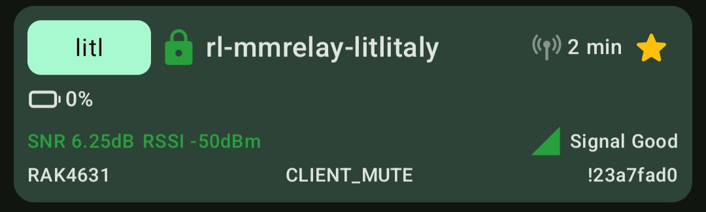

# Bots and bridges

This page documents various bots and bridges and how to configure
them.

We already have lots of new bots. Before setting up a new bot, please:

- consider whether it's really useful: there might already be one bot
  doing the same thing
- answer only on a specific prefix like `!test` instead of `test`, to
  avoid triggering needlessly
- don't *answer* in a way that might trigger existing bots, to avoid
  loops
- document your bot here, or at least on some website
- be responsive when people ask about your bot

## Known bots

In this section, we attempt to document the bots known to operate in
the greater Montréal area. Ideally, each bot should have:

- an owner
- a location
- whether it is still operational (and when that was checked)
- a homepage (where, ideally, source code is available)
- an overview of supported commands

### `EL-Bot`

- Owner: `EL`
- Location: `#bots`
- Status: online (2026-09-19)
- Commands:

    - `test`, responds with for example: `ack @[VE2CL-V4] | be1d1c,3a79a0,424242,3c7688,bfbeef (5 hops) | SNR: 10.75 dB | RSSI: -90 dBm | Received at: 21:03:17`
    - `multitest`, responds with e.g.

            @[T MeshPocket] found 3 unique path(s):
            e8b3ad ┐
            ├ 8e31d2
            ├ bf61f2,bfbeef
            └ c5ba0c,83a50f

### `YUL-Cartierville-bot`

- Owner: `Johnputer`
- Location: `#bots`
- Status: online (2026-09-19)
- Commands:
    - `test`, responds with e.g. `@[anarcat-techo] ✅`
    - `ping`, responds with `@[anarcat-techo] Pong! 🏓`

### `GrosTonyMoni`

- Owner: `GrosTonyMobil`
- Location: `#bots`
- Status: online (2026-09-19)
- Commands:
    - `test`, responds with `test reçue de St-Gabriel de Brandon`

### `T Meshcomod`

- Owner: `T Meshcomod`
- Location: `#bots`
- Status: online (2026-09-19)
- Commands:
    - `test`, responds with `🤖 Copy, @[Vanfax v4] @ 21:43
  Via 4 hops: a319b2→18fe10→bf61f2→e8b3ad`
    - `help`, responds with `(1/3) Say 'help <command>' for details.
Commands: advert, announce, aqi (airquality), channels (channel), dice
(roll), hamcall, hello` `(2/3) (hi/hey/+28), help (cmd/commands), joke (jokes/dadjoke/+10), mbx, moon, path (decode/route), ping (test), repeater (rp), schedule,`
- Announces new prefix collisions: `Prefix collision: new repeater YOW_Conroy_Repeater shares prefix f0 with Rename_1, YUL-Ste-Julie-Rep2`

### `YUL-Bois-Franc-Bot`

- Owner: ?
- Location: `#bots`
- Status: unresponsive (2026-09-19)
- Commands:
    - `test`, responds with e.g. 

            🏓 @[VE2FXO-T-Echo]: test!
            📡 3 hops (2f52→c5ba→4444→b9bf)
            💬 ping • test • metar [iata] • clipboard`

### `CECREVIER.CA/BOT`

- Owner: ?
- Location: `#bots`
- Status: unresponsive (2026-09-19)
- Homepage: https://cecrevier.ca/bot/
- Commands:
    - `test`, responds with e.g. `Vanfax v4: 2 hops: bf61f2>38f52c | clock offset +3s`

### `YUL-H2E-Ootserver`

- Owner: `Oots`
- Location: `#meteo`
- Status: online (2026-09-19)
- Commands:
    - `!weather LOCATION`, responds with `Montréal: 12C, Clear sky`
    - `!forecast LOCATION`, responds with `Pointe-Au-Pere 5d: | Sun 9/8C Broken | Mon 12/7C Light | Tue 12/9C Clear | Wed 12/9C Clear | Thu 13/11C Clear`

### `MG V4-BOT`

- Owner: `MG V4-mini`
- Location: `#bots`
- Status: online (2026-09-19)
- Commands: astronomy commands, see `mg help` for details, examples:
    - `mg sun` responds with:

            MG SUN (p1/2)
            Now Az 302.2° Alt -25.6°
            Nadir @ 00h48 In 3h18
            Rise @ 06h39 Az 87.7° In 9h09
            MG SUN (p2/2)
            Max @ 12h47 Alt 45.2° In 15h18
            Set @ 18h55 Az 272.0° In 21h26

## Bridging Matrix and Meshtastic

A Matrix bridge was in operation on the LongFast channel. It has been
turned off as of 2026-04-24, but this documentation is kept as future
reference if people want to build another one..

### Usage

Messages sent in the bridged room
([`#reseaulibre-meshtastic-bridge:matrix.org`](https://matrix.to/#/#reseaulibre-meshtastic-bridge:matrix.org))
will be sent to the Meshtastic "LongFast" channel and vice versa. It
is named `rl-mmrelay-litlitaly` on both sides. On Meshtastic, its
short name is `litl`.

The bridge also replies to direct messages.

It will show up like this in your device listing in the Android app:

<figure markdown="span">

  <figcaption>A sighting of the Matrix bot in the Meshtastic Android
  app, with the bot marked as favourite and a surprisingly Good signal.</figcaption>
</figure>

There are [plugins](https://github.com/jeremiah-k/meshtastic-matrix-relay/wiki/Core-Plugins) that allow for some fancier operations:

- `!ping` - send this to the channel from Meshtastic or Matrix to
  generate a response, useful to test reachability[^1]

[^1]: The bot is currently in Little Italy, with a poor antenna, so
don't be surprised if you don't hear it. It will be improved this
summer.

- `!health` - gives a series of stats about the health of the relay
  and network (Matrix-only), example:

        Nodes: 31
         Battery: 100.7% / 101.0% (avg / median)
         Nodes with Low Battery (<= 10): 0
         Air Util: 1.28 / 1.03 (avg / median)
         SNR: 3.93 / 6.00 (avg / median)

- `!weather` - gives a basic weather report (Meshtastic-only),
  example:
  
        Now: 🌙☁️ Overcast - -2.5°C | Humidity 82% | Wind 15.9km/h 51° | Precip 14%

    Use `location=` to change the location.

- `!airUtilTx` - shows channel utilization graph for the last 24h
  (Matrix-only), the `!batteryLevel` and `!voltage` give similar
  graphs, but currently useless as the device is powered over USB

- `!nodes` - shows the list of known nodes (Matrix-only)

- `!map zoom=12` - show a map of the network (Matrix-only), note that
  the default `zoom=8` is far too large for the current mesh size
### Configuration

There is now a [Matrix](https://matrix.org) bridge setup in the little Italy
neighbourhood. I essentially followed [this quick start guide](https://github.com/jeremiah-k/meshtastic-matrix-relay/wiki/Getting-Started-With-Matrix-&-MM-Relay) and
this [Docker guide](https://github.com/jeremiah-k/meshtastic-matrix-relay/blob/main/docs/DOCKER.md).

> [!WARNING]
> Do *not* naively follow this guide! If you add another relay that
> join the *same* room, you are likely going to create loops and
> extra traffic to the mesh. Make your own room for your own bot!

I first created a room in the Matrix space, then created a new account
and invited it to the room. The room is currently fully open to the
public but might be locked down if there's abuse, either by making the
room non-writable by Matrix users or invite-only.

Then I setup the container with the following `docker-compose.yml`
file:

```yaml
volumes:
  mmrelay-data:
  mmrelay-cache:

services:
  mmrelay:
    image: ghcr.io/jeremiah-k/mmrelay:latest
    container_name: meshtastic-matrix-relay
    restart: unless-stopped
    stop_grace_period: 30s
    user: "1337:20"
    environment:
      - MMRELAY_HOME=/data
      - MMRELAY_READY_FILE=/tmp/mmrelay-ready
      - TZ=UTC # Set timezone (PYTHONUNBUFFERED and MPLCONFIGDIR are set in Dockerfile)

    devices:
      - /dev/ttyACM0
    volumes:
      - mmrelay-data:/data
      - mmrelay-data:/.cache
```

Before starting the container, I created a user and group for it:

```
addgroup --system --gid 1337 mmrelay
adduser --system --uid 1337 --gid 1337 mmrelay
adduser mmrelay dialout
```

I am not sure if it was necessary, but I also fixed the perms on
there:

```
chown mmrelay:mmrelay /var/lib/docker/volumes/mmrelay_mmrelay-data/_data/
```

I could have used `mmrelay config generate` to create a sample configuration
file, but instead I used:

    curl -Lo /var/lib/docker/volumes/mmrelay_mmrelay-data/_data/config.yaml https://raw.githubusercontent.com/jeremiah-k/meshtastic-matrix-relay/main/src/mmrelay/tools/sample_config.yaml

Then edited the configuration:

```diff
--- sample_config.yaml	2026-03-15 20:01:08.939719431 -0400
+++ /var/lib/docker/volumes/mmrelay_mmrelay-data/_data/confia/config.yaml	2026-03-15 21:40:59.802696541 -0400
@@ -44,27 +44,25 @@
   # 4. For interactive setup, use: mmrelay auth login
   #
   e2ee:
-    enabled: true
+    enabled: false
 
   # Message prefix customization (Meshtastic → Matrix direction)
   #prefix_enabled: true # Enable prefixes on messages from mesh (e.g., "[Alice/MyMesh]: message")
   #prefix_format: "[{long}/{mesh}]: " # Default format. Variables: {long1-20}, {long}, {short}, {mesh1-20}, {mesh}
 
 matrix_rooms: # Needs at least 1 room & channel, but supports all Meshtastic channels
-  - id: "#someroomalias:example.matrix.org" # Matrix room aliases & IDs supported
+  - id: "#reseaulibre-meshtastic-bridge:matrix.org" # TODO: invite the bot here and then make room public
     meshtastic_channel: 0
-  - id: "!someroomid:example.matrix.org"
-    meshtastic_channel: 2
 
 meshtastic:
-  connection_type: tcp # Choose either "tcp", "serial", or "ble"
-  host: meshtastic.local # Only used when connection is "tcp"
-  serial_port: /dev/ttyUSB0 # Only used when connection is "serial"
-  ble_address: AA:BB:CC:DD:EE:FF # Only used when connection is "ble" - Uses either an address or name from a `meshtastic --ble-scan`
-  meshnet_name: Your Meshnet Name # This is displayed in full on Matrix, but is truncated when sent to a Meshnet
+  connection_type: serial # Choose either "tcp", "serial", or "ble"
+  #host: meshtastic.local # Only used when connection is "tcp"
+  serial_port: /dev/ttyACM0 # Only used when connection is "serial"
+  #ble_address: AA:BB:CC:DD:EE:FF # Only used when connection is "ble" - Uses either an address or name from a `meshtastic --ble-scan`
+  meshnet_name: RL # This is displayed in full on Matrix, but is truncated when sent to a Meshnet
   message_interactions: # Configure reactions and replies (both require message storage in database)
-    reactions: false # Enable reaction relaying between platforms
-    replies: false   # Enable reply relaying between platforms
+    reactions: true # Enable reaction relaying between platforms
+    replies: true   # Enable reply relaying between platforms
 
   # Connection health monitoring configuration
   #health_check:
@@ -116,7 +114,7 @@
 # These are core Plugins - Note: Some plugins are experimental and some need maintenance.
 plugins:
   # Global setting for all plugins: require bot mentions for commands
-  #require_bot_mention: true  # Set to false to disable mention requirements for all plugins
+  require_bot_mention: false  # Set to false to disable mention requirements for all plugins
   
   ping:
     active: true
@@ -125,13 +123,21 @@
   weather:
     active: true
     #require_bot_mention: true  # Override global setting for this plugin only
-    units: imperial # Options: metric, imperial - Default is metric
+    units: metric # Options: metric, imperial - Default is metric
     #channels: [] # Empty list, will only respond to DMs
   nodes:
     active: true
     #require_bot_mention: true  # Override global setting for this plugin only
     # Does not need to specify channels, as it's a Matrix-only plugin
 
+  health:
+    active: true
+  telemetry:
+    active: true
+  map:
+    active: true
+
+
 #community-plugins:
 #  sample_plugin:
 #    active: true
```

> [!WARNING]
> Again, at this stage, do *not* use the above room
> configuration. Pick your own room!

At this point, the container should be able to start:

    docker-compose up

... and `mmrelay` commands can be ran with:

    docker-compose exec mmrelay mmrelay

The `mmrelay auth login` created the `matrix/credentials.json` file
with an access token the the home server configuration.

A RAK4631 development kit is hooked up to the server over USB, hanging
off the side in a janky setup in my basement. The board itself is
configured [as normal](../../guides/meshtastic.md) except:

- hops: 7 (the node is in my basement and will necessarily go through
  at least one hop, and is designed to try to relay things)
- device role: `CLIENT_MUTE`, to avoid re-broadcasting, as we're an
  endpoint

The node itself has limited view of the network and relies on a
second, better positioned, relay to transmit its traffic.[^2]

[^2]: This is not ideal: ideally, we'd connect directly to the better
positioned router, but that router is not actually setup correctly yet
either, so we'll wait. Ultimately, I want to have a relay on the roof
and connect to it with a relay like this over Bluetooth, and I'd
probably install (and upgrade) the bot with `pip` then, on a
single-board computer like a Beagle Board or Raspberry Pi.

Note that in the above patch, there are some [plugins](https://github.com/jeremiah-k/meshtastic-matrix-relay/wiki/Core-Plugins)
enabled as well, see below on how to use those.
